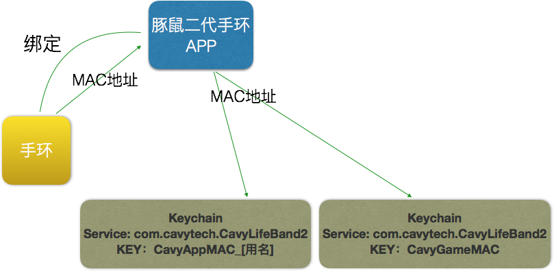
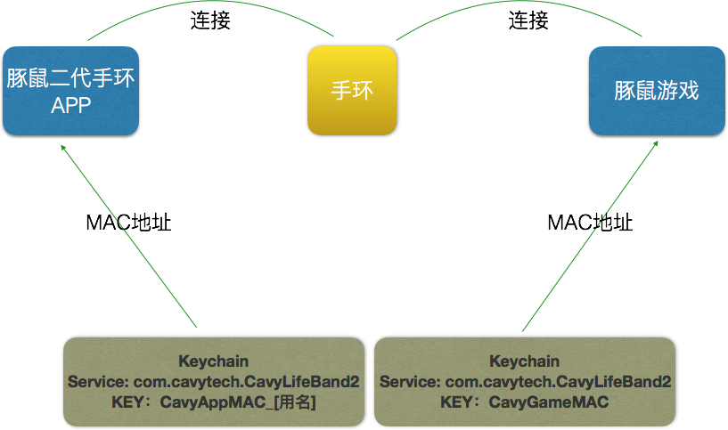

## 手环绑定流程

### 流程图说明

- 绑定手环时，APP从手环获取MAC地址
- 绑定成功，APP 
- 为了支持一个手机可以绑定多个不同用户的手环，APP保存的Key后面增加用户账号作为后缀
- 为了保证游戏自动连接永远连接最后绑定的手环，同时支持一个手机可以绑定多个不同用户的手环，所以APP读的Keychain和游戏读的Keychain分开存储

## 手环连接流程

### 流程图说明

- 游戏和APP在连接时都去读取Keychain的Mac地址
- Keychain不存在则未绑定
- Keychain的service值为**com.cavytech.CavyLifeBand2**
- Keychain的KEY：**CavyAppMAC_[用名]** 供APP读取
- Keychain的KEY：**CavyGameMAC** 供游戏读取